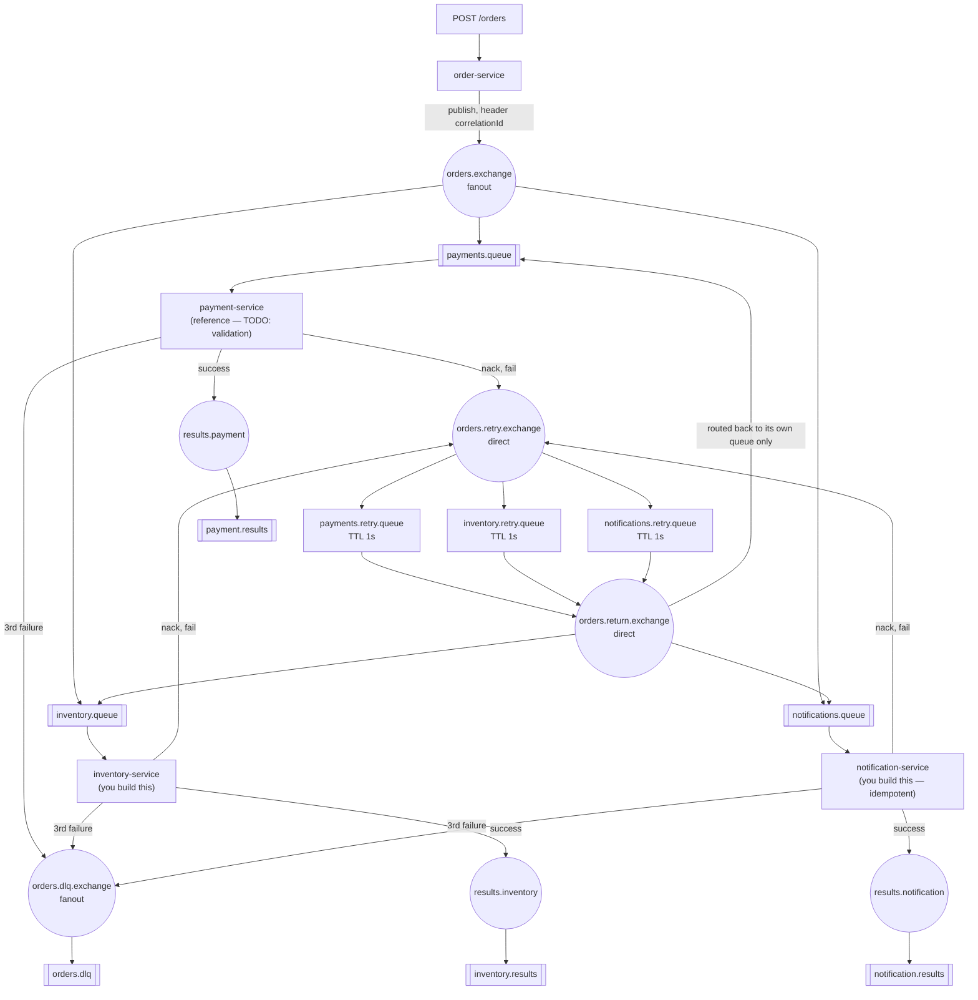

# PA5 — Events, dead-letter queues, idempotency

| | |
|---|---|
| **Session** | S5 — Reliable messaging and error handling · 2026-10-14, A410 |
| **Scaffold language** | TypeScript |
| **Published** | with S5 on 2026-10-14 |
| **Deadline** | **2026-10-26, 20:00 Europe/Riga** |
| **Hard cut-off** | **2026-11-02, 20:00** — miss it and the capstone is not graded |
| **Weight** | one seventh of the homework half — about 7.1% of the final grade |
| **Mark** | 70% automated tests, 30% manual (ADR quality, self-assessment honesty) |
| **ADR** | `docs/adr-004.md` |

---

## The situation

An order placed on your system has to reach three independent departments —
payment, inventory, notification — and none of them should have to know the
other two exist. None of them are reliably up, either: a payment provider
that is down for thirty seconds is not your order service's outage, and it
is definitely not a reason to lose the order.

You build the producer and let three consumers subscribe independently
(publish-subscribe over a fanout exchange), and you build a retry path that
gives a failing consumer a few seconds to recover before giving up and
routing the message somewhere a human can look at it (dead-letter channel,
TTL-based delayed retry). Every message carries a correlation id so the
whole lifecycle of one order can be traced across three unrelated services'
logs (correlation identifier). And because the retry topology below
deliberately re-delivers a retried message to **every** consumer, not just
the one that failed, at least one of your consumers has to cope with seeing
the same message twice without doing its work twice (idempotent receiver).

This is PA2 all over again, with three consumers instead of one and a
failure path that actually gets exercised. The broker topology is provided
and pre-declared — you are not building exchanges and queues by hand this
week, you are building what talks to them.

---

## What you are given

`shared/rabbit.ts` — `connectWithRetry(url)` (exponential-backoff connect,
handles the container startup race against RabbitMQ) and `getRetryCount(msg)`
(reads the `x-death` header RabbitMQ attaches once a message has been
dead-lettered). Mounted read-only into every service container at
`/app/shared`; import it by relative path (`../../shared/rabbit`).

`shared/canonical-order.ts` — a TypeScript mirror of
[`../canonical/order.schema.json`](../canonical/order.schema.json) (owned by
the course since PA4). PA5 does not transform anything — every message this
assignment moves is already in this shape.

`rabbitmq/definitions.json` — the **complete** topology, loaded by RabbitMQ
on startup. You do not declare a single exchange, queue, or binding this
week; see the diagram below for what already exists.

`order-service/`, `inventory-service/`, `notification-service/` —
**empty** `src/server.ts` scaffolds. You write all of it.

`payment-service/` — **the reference consumer**. `src/server.ts` already has
the RabbitMQ connection, the `channel.consume` registration, and the full
retry/DLQ catch block working. Study this file before touching the other
two — it is the pattern you replicate in `inventory-service` and
`notification-service`. Only the `try` block (payment validation itself) is
a TODO.

Every scaffold's process stays alive on its own even completely untouched
(see the comment at the top of each `src/server.ts`) — `docker compose up
-d --wait` is expected to succeed regardless of how much you have
implemented. This assignment is graded to fail at `npm --prefix tests test`,
with a readable message, not at `docker compose up --wait`, with a timeout.

---

## Architecture



**Read this carefully:** `payments.retry.queue`, `inventory.retry.queue` and
`notifications.retry.queue` each dead-letter back through
`orders.return.exchange` (a **direct** exchange) to their **own** consumer
queue only — not back through the fanout. This is a deliberate topology
choice over the naive version (retry queues dead-lettering straight back to
`orders.exchange`), which would re-deliver every retried message to **all
three** consumers, not just the one that failed. See `docs/adr-004.md` for
why the naive version is still worth knowing about, and why the
idempotency requirement below exists regardless of which topology you use.

---

## What to build

### 1. `order-service/src/server.ts` — empty

- **`POST /orders`** — body is a canonical order (see
  `shared/canonical-order.ts`). It already has an `orderId`; you did not
  invent it and you do not renumber it. Generate a correlation id
  (`crypto.randomUUID()` — built into Node 20, no dependency needed) and
  publish the order **unchanged** to `orders.exchange`, with
  `headers: { correlationId }`. Do **not** add a `correlationId` field to
  the order object itself — the canonical schema's `additionalProperties`
  is `false`, so an extra field on the body is a validation error, not a
  convenience. See `docs/adr-004.md` for why correlationId lives in a
  header instead. Store the order in memory keyed by correlationId, and
  respond `201` with `{ correlationId, status: "accepted" }`.
- **`GET /orders/:correlationId`** — `200` with `{ correlationId, order }`
  if found, `404` otherwise.
- **`GET /health`** — `200` with `{ status: "ok" }`.

### 2. `payment-service/src/server.ts` — partially scaffolded

Replace the `throw new Error("Not implemented...")` with: roll a random
number against `PAYMENT_FAIL_RATE`; below it, throw (the provided catch
block already handles retry/DLQ correctly — do not touch it); otherwise,
`ack` and publish a result event to `results.payment` with the same
`correlationId` header.

### 3. `inventory-service/src/server.ts` — empty

Same pattern as `payment-service`, mechanically identical: consume
`inventory.queue`, use `INVENTORY_FAIL_RATE`, publish to
`results.inventory`. Copy the retry/DLQ catch block from `payment-service`
rather than reinventing it — it is intentionally shared code that happens to
be duplicated per service, not a library, because seeing it three times is
part of the point this week.

### 4. `notification-service/src/server.ts` — empty

Consume `notifications.queue`. Before processing, check whether
`correlationId` is already in `/data/processed-ids.json`
(bind-mounted, survives a service restart) — if so, `ack` silently and log
"duplicate skipped", **without** touching `/data/notification.log`.
Otherwise append one JSON line to `/data/notification.log`:

```jsonc
{"correlationId":"...","orderId":"...","customerEmail":"...","timestamp":"...","message":"Order received"}
```

add the correlationId to the processed set, persist it, `ack`, and publish
a result event to `results.notification`. Same retry/DLQ pattern as the
other two on any thrown error.

---

## Ports — this assignment's own range

RabbitMQ AMQP is on host port **5674**, the management UI on **15674**, and
order-service's HTTP API on **3002**. Every container is named `pa5-*`.
Payment/inventory/notification have no host port mapping — nothing outside
the Docker network needs to reach them directly. This is the same
non-overlapping-ranges convention as every other PA in this repo; if a
`docker compose up` here ever fails to bind a port, the fix is never "stop
another assignment's stack."

RabbitMQ itself runs as a named user (`eai` / `eai-pa5`), not `guest`/
`guest` — see `docs/adr-004.md` and PA2's `docs/adr-001.md` for why.

---

## Running it

```bash
cd pa5
docker compose up -d --wait
npm --prefix tests test
```

Windows: `docker compose` and `npm`, nothing else.

Watch the retry path actually happen:

```bash
docker compose logs -f payment-service
```

Force it to fail for a few seconds and watch the DLQ fill:

```bash
PAYMENT_FAIL_RATE=100 docker compose up -d payment-service
curl -X POST http://localhost:3002/orders -H "Content-Type: application/json" -d @- <<'EOF'
{
  "orderId": "WEB-2026-002",
  "orderType": "standard",
  "source": "web",
  "receivedAt": "2026-10-14T09:00:00Z",
  "orderDate": "2026-10-14T09:00:00Z",
  "customer": {
    "name": "Anna Bērziņa",
    "email": "anna.berzina@example.com",
    "address": { "street": "Brīvības iela 100", "city": "Rīga", "postalCode": "LV-1001", "country": "LV" }
  },
  "items": [
    { "productId": "PROD-001", "productName": "Wireless Mouse", "quantity": 2, "unitPrice": "22.50", "currency": "EUR", "taxRate": 0.21 }
  ],
  "currency": "EUR",
  "status": "new"
}
EOF
```

Open <http://localhost:15674> (`eai` / `eai-pa5`) and watch `orders.dlq`
gain a message about six seconds later (three attempts, 1s TTL each, plus
processing time). Put `PAYMENT_FAIL_RATE` back to a normal value (or just
`docker compose up -d payment-service` with no override) before you run the
tests again — test 4 and test 7 do this restart themselves, but a payment
service still stuck at 100% will fail test 5 and test 6, which don't expect
it.

Tear down (including the RabbitMQ data volume) with:

```bash
docker compose down -v
```

---

## Where to start

1. **`order-service` first.** Nothing else is reachable without it — every
   test posts an order before it asserts anything. Get `POST /orders`
   returning `201` with a correlation id, then `GET /orders/:correlationId`
   finding it again.
2. **Read `payment-service/src/server.ts` end to end** before writing
   `inventory-service`. The retry/DLQ block you are about to duplicate is
   already there, working, and commented.
3. **`inventory-service`**, copying that pattern.
4. **`notification-service`**, the idempotency check first — get the happy
   path (one order, one log line) working, then the duplicate case.
5. **Watch a full DLQ cycle once**, with `docker compose logs -f`, before
   trusting the automated tests to tell you it worked.

If you are stuck for more than thirty minutes, ask — see
[CONTRIBUTING.md](../CONTRIBUTING.md).

---

## Rules

`amqplib` (and, for `order-service` only, `express`) are the only runtime
dependencies this assignment needs — already in each service's
`package.json`. You do not need a validation library to check the incoming
body's shape against the canonical schema; a handful of `typeof` checks is
enough for this week (PA4 already did schema-shaped validation properly;
this assignment is about messaging, not re-litigating that).

You may of course read documentation, and you may use AI tools — but see
[SYLLABUS.md](../SYLLABUS.md) §12: you have to be able to defend every line
in November, on your own code, with a fault planted in it.

---

## What is tested

Public tests (`tests/public/`, run them yourself with `npm --prefix tests
test`) are the same seven black-box checks the proven JS lab this
assignment is ported from has used for two years, unchanged in behaviour.
They check that:

- `docker compose up` brings up a reachable order-service and all three
  consumer queues have an active consumer
- `POST /orders` returns `201` with a UUID v4 `correlationId`, and the order
  can be fetched back by it
- `orders.exchange` is a fanout exchange with all three consumer queues
  bound and consuming
- forcing `PAYMENT_FAIL_RATE=100` and posting an order lands a message in
  `orders.dlq` within ten seconds of the retry window elapsing
- one order's `correlationId` shows up on all three `*.results` queues
- posting the same order twice through `notifications.queue` (simulating
  the retry topology's redelivery) produces exactly one
  `notification.log` line, not two
- a message that fails three times carries an `x-death` header showing at
  least two retry cycles before it reaches the DLQ
- `docs/adr-004.md` exists with its four sections

There are no hidden PA5 test cases beyond these seven — unlike this
assignment's siblings, WP-13's brief ported the existing suite as-is rather
than adding new ones. That does not mean tuning your code to these seven
literal assertions is a good idea: they are still black-box checks of the
same requirements stated above, and a correct implementation passes them
without having been aimed at them.

---

## Your ADR

`docs/adr-004.md`, four sections, one page. **It is 30% of this
assignment's mark.** The template has the prompts; the short version of what
it is asking:

> You made at least three real decisions this week: where correlationId
> actually lives on the wire, what your retry threshold is and why three
> attempts specifically, and why the idempotency check is a file and not an
> in-memory `Set`. Show your reasoning on the ones that were genuinely open
> questions for you.

Write it after the code, while the annoyance is still fresh.

---

## Submitting

Your work goes in **your** repository, not this one:

```text
eai-2026-<surname>/
  pa5/
    shared/                    your copy, unchanged unless you found a real bug in it
    order-service/             your implementation
    payment-service/           your implementation (scaffold's retry/DLQ block kept)
    inventory-service/         your implementation
    notification-service/      your implementation
    tests/public/               unchanged, as given
    docker-compose.yml
    rabbitmq/
    docs/adr-004.md
```

Then submit your repository URL through the portal at
**<https://evaluentis.leitass.eu>**. Never by email.

See [how an assignment works](../README.md#how-an-assignment-works) in the
root README for the late penalty and the progression gate. The graded
commit is the SHA at `HEAD` **when you submit** — later pushes are not
seen. Run `docker compose up -d --wait && npm --prefix tests test` one more
time before you do.

---

## Common ways to lose marks

| | |
|---|---|
| `channel.publish(routingKey, exchange, ...)` | Backwards. It is `channel.publish(exchange, routingKey, content, options)` — exchange first |
| `nack(msg, false, true)` (requeue=true) | Skips the retry delay entirely and can loop forever with no `x-death` header ever appearing |
| Acking the original message AND publishing to the DLQ separately without acking | The message ends up both processed and stuck in the consumer queue |
| In-memory idempotency `Set` for notification-service | Passes the visible test (no restart happens mid-test) but loses all dedup state on `docker compose restart notification-service` — say so in your ADR if you do this anyway |
| Adding `correlationId` as a field on the canonical order body | `additionalProperties: false` in `canonical/order.schema.json` makes this a schema violation, not a convenience |
| Forgetting `channel.prefetch(1)` | Messages dispatched faster than they are processed; ack ordering breaks under load, intermittently |
| Leaving RabbitMQ on `guest`/`guest` | Works over AMQP, then can quietly fail management-API calls made from outside the container on some hosts — see `docs/adr-004.md` |
| An ADR that restates this README | 30% of the mark, and I have read this README |
